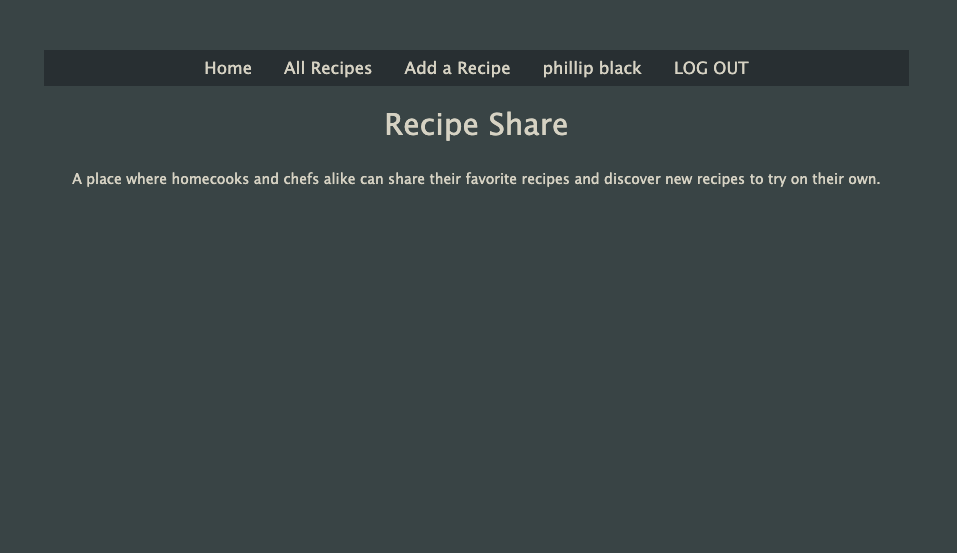
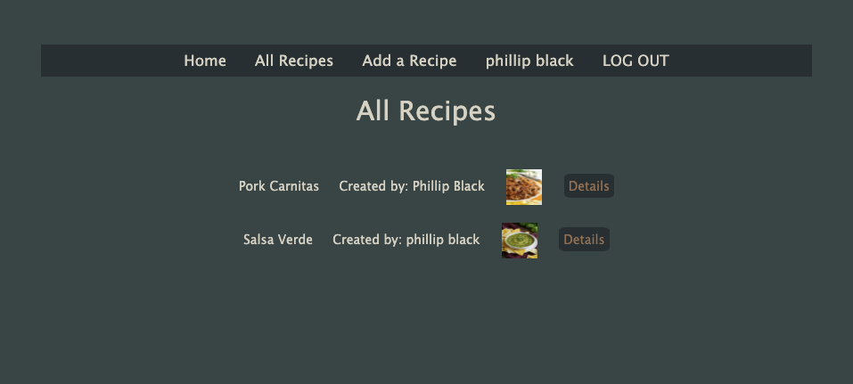
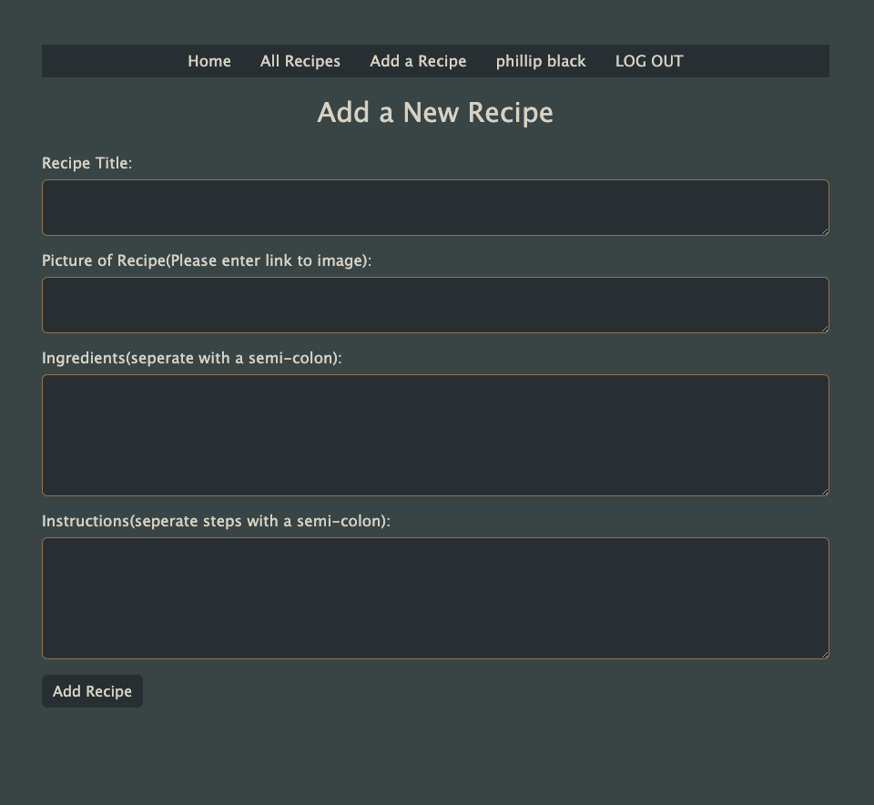

## Recipe Share
Recipe share is a web application designed for cooking enthusiasts to post and store their favorite recipes.  A user can post their recipes with an image, view their recipes, view other users recipes, and post comments on each recipe.  

[Recipe Share](https://recipe-share-oo.herokuapp.com/)
[Project Planning](https://trello.com/b/iPClgZIf/project-2)

I designed the site with a simple and elegant color scheme that is continuos throughout.

## Functionality

The home page greets the user andd provides them with a mission statement for the application. If the user in not signed in,  they can either view a page with other users recipes,  or sign in using google OAuth.  

The all recipes page displays the name, creator and an imgage of each recipe posted on the application. The user can also click a link to each recipes details, which will display each recipe full post.  

After the user has logged in, they can add a recipe.  

## Technologies Used

HTML, CSS, Bootstrap, Javascript, Express, Mongoose, MongoDB

## Future Additions
[ ] Image panel on home page, randomly displaying user recipes bellow mission statement.  

[ ] Edit recipe functionality.   

[ ] Add would make again option when commenting on a recipe. 

